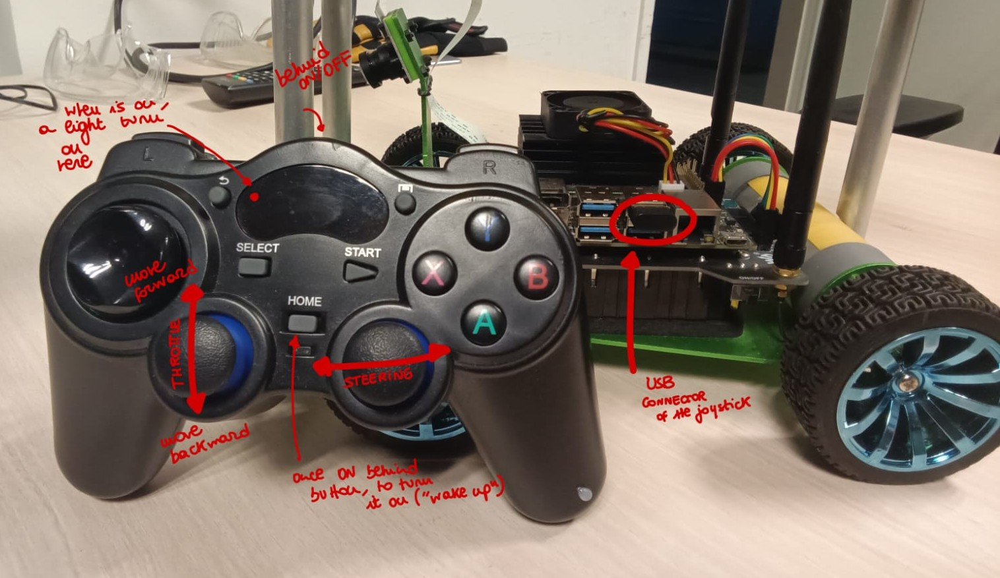

## On the steering car

Turn on and check that it is connected to the wifi ```hds_platforms_roam```

Open the terminal and run 
```bash
    $ roslaunch cytron_jetracer teleop.launch
```
The launcher will run the nodes defined in the scripts ```racecar.py``` and ```teleop_gamepad.py```.

```xml
<?xml version="1.0"?>

<launch>

<!-- rviz -->
	<!--	<include file="$(find cytron_jetracer)/launch/rviz.launch"></include>  -->

<!-- Control car -->
	<node name="racecar" pkg="cytron_jetracer" type="racecar.py" output="screen"></node>

<!-- teleoperation joystick -->
	<node name="teleop_joystick" pkg="cytron_jetracer" type="teleop_gamepad.py" output="screen"></node>

</launch>
```

Turn on the joystick (behind the ON/OFF button and/or HOME button) and check that is connected the USB.




## On your computer

Change the bashrc

```bash
    $ gedit ~/.bashrc
```

adding(/changing) the following lines

```
export ROS_IP=172.26.213.70 # IP on the cable
export ROS_HOSTNAME=172.26.213.70
export ROS_MASTER_URI=http://172.26.217.33:11311 # if the using the Jetracer car, otherwise put your IP cable
```

Source the bashrc.

```bash
    $ source ~/.bashrc
```

To retrieve the data from the Optitrack, create the following launcher

```xml

<?xml version="1.0"?>

<launch>
    <!-- To retrieve OptiTrack data -->
    <arg name="server" default="172.26.213.1"/>
    <node pkg="vrpn_client_ros" type="vrpn_client_node" name="vrpn_client_node" output="screen">
    <rosparam subst_value="true">
        server: $(arg server)
        port: 3883
        frame_id: 1
        broadcast_tf: true
        # Must either specify refresh frequency > 0.0, or a list of trackers to create
        refresh_tracker_frequency: 1.0
        #trackers:
        #- FirstTracker
        #- SecondTracker
    </rosparam>
    </node>
</launch>
```

When creating the object with the Optitrack, do it as is done with the drones. 
Put the robot with the camera looking forward and create the object. Then rotate areound the yaw of 90 degrees.

Run the launcher (in this case it has been added to the steering_car_PD package)
```
    $ roslaunch steering_car_pd control_vrpn.launch
```

## Useful links

* cytron_jetracer ROS package : https://github.com/CytronTechnologies/cytron_jetracer/tree/master